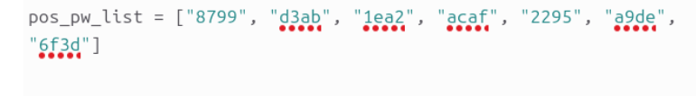

# PW Crack 3
**Challenge Source:** [pico-ctf](https://play.picoctf.org/practice/challenge/247?page=1&tag=6)
### Step 1
I first run the file in vscode but it indicated that it couldn’t find the file anywhere. Since there are no other factors to consider, and upon looking at the code, I came to a conclusion that VSCode is preventing the python script from accessing the enc file.
Enc Tool info: https://pypi.org/project/enc-tool/ 
### Step 2
I searched the net of other ways to run python script and learned that u can run python script in terminal by opening the file using nano. 
### Step 3
After opening it using nano and then saving it, I run the script file and it asked me for a password. 
### Step 4
What I did here is that I analyzed the code and apparently u can just do trial and error and check each password in the list if the script will give u the flag.

### Step 5
Once I got the correct password, I was able to get the flag.
